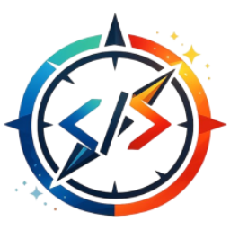
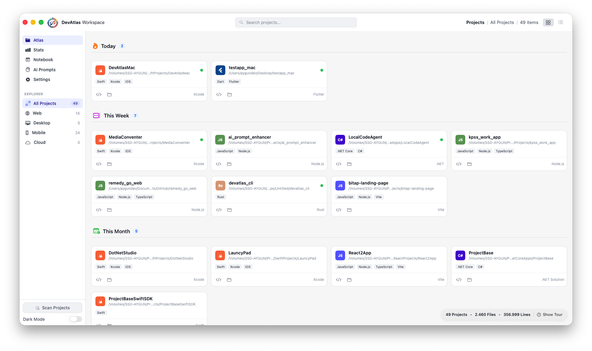
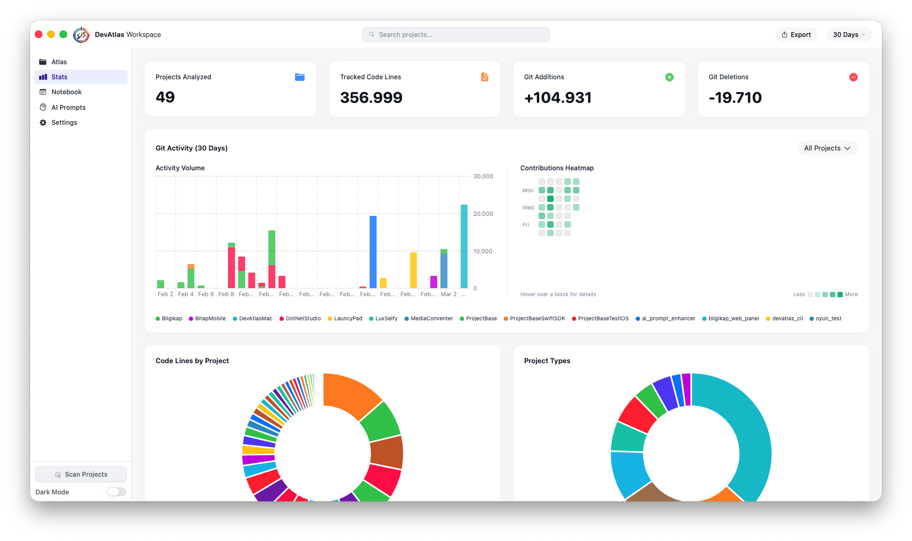
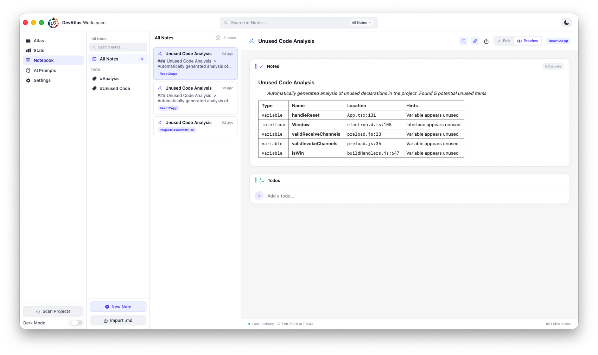
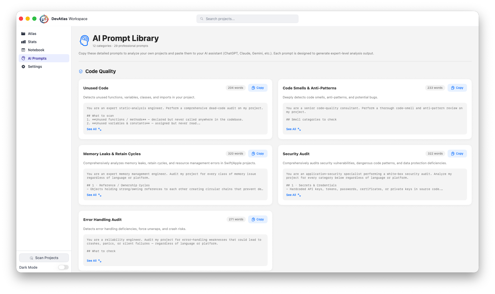
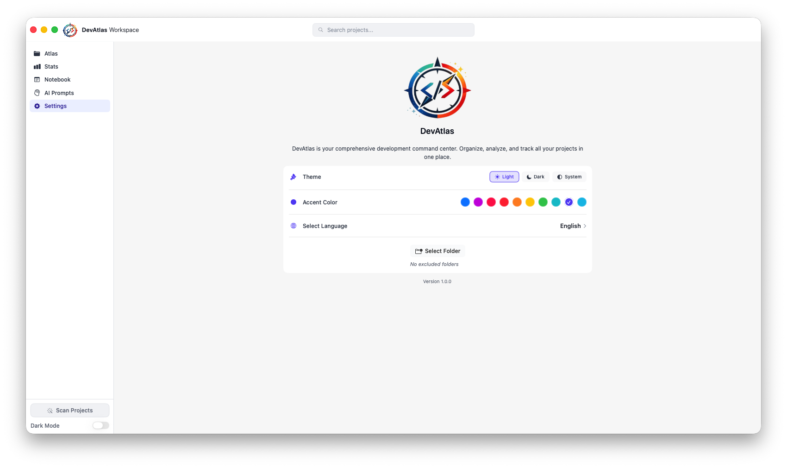

# DevAtlas for macOS

<div align="center">




**A native macOS command center for your entire local codebase.**  
Discover projects, inspect dependencies, analyze code health, track Git activity, keep project notes, and jump into work instantly.

[Features](#-features) • [Getting Started](#-getting-started) • [Tech Stack](#-tech-stack) • [Contributing](#-contributing)

</div>

---

## What is DevAtlas?

DevAtlas is a native macOS app built with SwiftUI for developers who manage many local repositories at once. It scans your disks, identifies real projects from ecosystem-specific marker files, groups them by category and recency, surfaces dependency and code-health signals, and gives you one place to open, inspect, and continue work.

Instead of acting like another launcher, DevAtlas combines **workspace discovery**, **codebase intelligence**, **Git analytics**, **project notes**, and **quick actions** in a single desktop app.

## Why It Stands Out

- **Whole-machine project discovery**: scans your home folder and mounted volumes, with smart exclusions and custom ignore paths
- **Polyglot project understanding**: recognizes Swift, Node.js, Flutter, Go, Rust, .NET, Python, Java, Docker, and more from real project markers
- **Built-in dependency visibility**: parses manifests across multiple ecosystems and shows what each project depends on
- **Actionable code insights**: includes unused code analysis, AI prompt workflows, line/file metrics, and Git activity trends
- **Native developer workflow**: open projects in installed editors, Terminal, Finder, or Xcode without leaving the app
- **Zero third-party runtime dependencies**: built entirely on Apple's native frameworks

## Screenshots

| Screen | Description | Screenshot |
|---|---|---|
| Atlas | Main workspace view for discovering, filtering, and opening local projects. |  |
| Stats | Portfolio-level dashboard for code volume, project mix, and Git activity. |  |
| Notebook | Project-linked notes and todos with Markdown editing and organization tools. |  |
| AI Prompts | Curated engineering prompts for audits, refactoring, testing, and documentation workflows. |  |
| Settings | App preferences for theme, language, scanning behavior, and personalization. |  |

---

## ✨ Features

### 🔍 Intelligent Project Discovery
DevAtlas's core strength is automatic project indexing across your machine. It scans mounted volumes and your home directory, resolves symlinks, removes duplicates, skips noisy folders, and turns raw directories into a structured project atlas.

- Full-disk recursive scan with smart exclusions (`node_modules`, `.git`, `build`, `dist`, etc.)
- Auto-detects project type from marker files (`package.json`, `go.mod`, `pubspec.yaml`, `Dockerfile`, ...)
- Timeline grouping: **Today**, **This Week**, **This Month**, **Older**
- Live search with `⌘P` quick-launch
- Custom exclusion paths for personalized scanning

---

### 🤖 AI-Powered Code Analysis
DevAtlas ships with a dedicated prompt workspace for reviewing, refactoring, documenting, and stress-testing your code with external LLMs. The prompts are organized by engineering intent, so the app becomes a practical launchpad for deeper audits instead of a generic prompt list.

#### 📊 Code Quality
| Prompt | Description |
|--------|-------------|
| Unused Code Detection | Comprehensive dead-code audit across your entire project |
| Code Smells | Identify anti-patterns and bloaters (long methods, duplicate code, etc.) |
| Memory Leaks | iOS/macOS-specific memory issue detection |
| Security Audit | White-box security analysis for vulnerabilities |
| Error Handling | Audit error-handling weaknesses that could lead to crashes |

#### ⚡ Performance
| Prompt | Description |
|--------|-------------|
| Bottleneck Analysis | Holistic performance audit with profiling suggestions |
| SwiftUI Render Optimization | View rendering efficiency improvements |
| App Launch Optimization | Minimize time-to-interactive |

#### 🏗️ Architecture
| Prompt | Description |
|--------|-------------|
| Architecture Review | Comprehensive architecture assessment |
| Design Patterns | Pattern usage analysis and opportunities |
| Refactoring Guide | Martin Fowler-based refactoring suggestions |

#### 🧪 Testing
| Prompt | Description |
|--------|-------------|
| Test Coverage Analysis | Identify untested code paths |
| Unit Test Audit | Test quality and reliability review |
| Test Generator | Generate production-quality unit tests |

#### 📚 Documentation
| Prompt | Description |
|--------|-------------|
| API Documentation | DocC-compatible documentation generation |
| README Generator | Complete project documentation |
| Comments Audit | Code comment quality review |

#### 🔧 Other Categories
- **Debugging**: Crash analysis, Xcode Instruments guide
- **Networking**: API audit, mocking setup
- **Accessibility**: WCAG 2.1 AA and Apple HIG compliance
- **Localization**: i18n/l10n audit
- **CI/CD**: Git workflow, pipeline design
- **Dependencies**: Third-party dependency audit
- **Code Generation**: CRUD generator, boilerplate generator

---

### 📦 Dependency Management & Version Checker
Dependency insight is built into the project detail flow. DevAtlas parses manifests directly from each repository and aggregates regular, development, and grouped project dependencies where applicable.

| Ecosystem | Manifest File |
|---|---|
| JavaScript / TypeScript | `package.json` |
| Flutter / Dart | `pubspec.yaml` |
| Go | `go.mod` |
| Rust | `Cargo.toml` |
| Swift (SPM) | `Package.swift` |
| Swift (CocoaPods) | `Podfile` |
| Swift (Carthage) | `Cartfile` |
| .NET / C# | `.csproj`, `.sln` |

DevAtlas also checks package versions against upstream registries so outdated dependencies are visible without manually opening each manifest.

---

### 🧹 Unused Code Analyzer
Dead code is technical debt. DevAtlas scans your source files and highlights symbols that are defined but never used:

- **Swift** — functions, classes, structs, enums, variables
- **C#** — unused classes and methods
- **JavaScript / TypeScript** — unreferenced exports and declarations
- **Dart** — unused declarations

> 💡 **Smart Detection**: The unused code analysis button only appears when your project uses a supported language (Swift, C#, JavaScript, or Dart).

---

### 📊 Project Statistics & Git Insights
The stats dashboard turns your local repos into a portfolio-level view. It combines code volume, project mix, and Git contribution history into one interface built with Swift Charts.

- Total file count and **lines of code** per project
- **Git commit history**: commit count, activity graph, lines added/deleted
- Date-range filtering for Git stats
- **Export** statistics as CSV or JSON
- Interactive **Charts** for visualizing data

---

### 📝 Notebook
DevAtlas includes a local notebook layer so project context stays attached to the codebase instead of being scattered across separate apps.

- Notes and tasks tied to specific projects
- Full **Markdown rendering**
- Tag and category system for quick filtering
- Cross-project search by content, project, or tag
- Todo items with priority levels and status tracking

---

### ⚡ Quick Actions
Once a project is indexed, DevAtlas is also the fastest way back into it. Quick actions are designed for immediate context switching between discovery and execution.

- **VS Code**, **Xcode**, **Cursor**, **Windsurf**, **Antigravity**
- Open in **Terminal** or **Finder** with one click
- `⌘P` keyboard shortcut for instant project search
- Run detected Node-based project scripts directly from the app

---

### 🎨 Beautiful UI/UX
- Native macOS look and feel with smooth animations
- Full **Dark Mode** support
- Custom accent colors to match your preference
- Responsive grid layouts

---

### 🌍 Localization
- Localized UI for English, Turkish, German, French, Italian, Japanese, Korean, and Simplified Chinese
- Language switching built into settings
- Native SwiftUI interface with macOS-first interaction patterns

---

## 🛠 Tech Stack

| Layer | Technology |
|---|---|
| Language | Swift 5.9 |
| UI Framework | SwiftUI 5 |
| Concurrency | Swift Concurrency (`async/await`, `actor`) |
| State Management | `@Observable` (Observation framework) |
| Minimum OS | macOS 14.0 Sonoma |
| Build Tool | Xcode 15+ |

Zero third-party dependencies — built entirely on top of Apple's native frameworks.

---

## 🚀 Getting Started

```bash
git clone https://github.com/kodzamani/DevAtlasMac.git
cd DevAtlasMac
open DevAtlasMac.xcodeproj
```

Press `⌘R` in Xcode to build and run. No additional setup required.

**Requirements:** macOS 14.0 or later · Xcode 15.0 or later

---

## 📁 Project Structure

```
DevAtlasMac/
├── DevAtlasMacApp.swift          # App entry point
├── ContentView.swift             # Root view & tab routing
├── Views/
│   ├── Atlas/                    # Project list, grid & detail
│   ├── Stats/                    # Statistics dashboard
│   ├── Notebook/                 # Note-taking
│   ├── Settings/                 # App preferences
│   ├── Onboarding/               # First-launch walkthrough
│   └── AIPrompts/               # AI-powered code analysis
├── ViewModels/                   # Business logic & state
├── Services/
│   ├── ProjectScanner.swift      # Disk-scanning engine
│   ├── DependenciesService.swift
│   ├── VersionCheckerService.swift
│   ├── GitStatsService.swift
│   ├── Dependencies/             # Per-ecosystem manifest parsers
│   └── UnusedCodeAnalyzer/       # Static analysis engine
├── Models/                       # Data models
├── Components/                   # Reusable SwiftUI components
├── Extensions/                   # Swift extensions & helpers
└── *.lproj/                      # Localization strings
```

---

## 🤝 Contributing

Contributions are welcome!

1. Fork the repository
2. Create a feature branch: `git checkout -b feature/your-feature`
3. Commit your changes: `git commit -m 'Add your feature'`
4. Push: `git push origin feature/your-feature`
5. Open a Pull Request

Please open an issue first for significant changes.

---

## 📄 License

This project is licensed under the MIT License.

---

<div align="center">

Built with ❤️ for macOS developers · Native · Fast · No subscriptions

</div>
